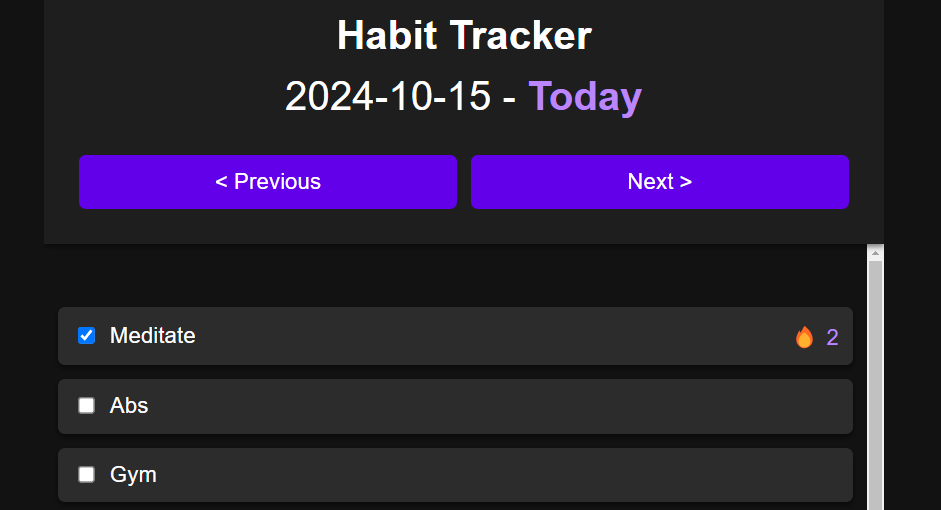

# Google Sheets Habit Tracker PWA

Simple habit tracker with Google Sheets backend using Google Apps Script.

Works well on both mobile and web (installable as PWA App on iOS and Android)

# Installation

- Create a Google Sheets workbook
- Create two sheets, one named `HabitTracker` storing all your data, and the other `Metadata`, which serves as a list of unique habits you'd like to keep track of.

---

---
- Go to Extensions -> Apps Script
- Create a new Project
- In the `Code.gs`, replace content with the `Code.gs` in this repo.
- Create an `index.html` file, and fill with content from `index.html`.
- Deploy the app by Deploy -> New Deploymnet -> Who has access: Only Myself
- You can access the front end with the link. Also installable as PWA on iPhone. 

# Tracking and Analytics

The data is normalised. There is a date field, and there is a habits field. If the habit has been done, there will be a habit field. If not, it will not exist for that day. 

You can therefore quite easily analyze trends and build views/charts using pivot tables:

